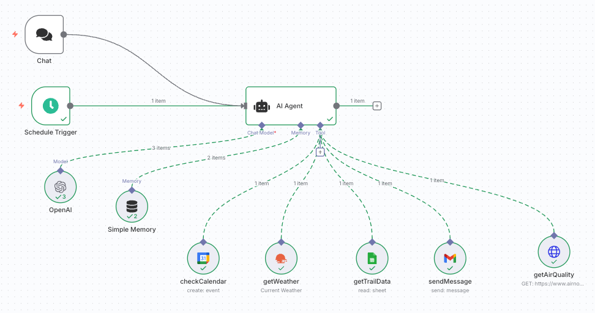
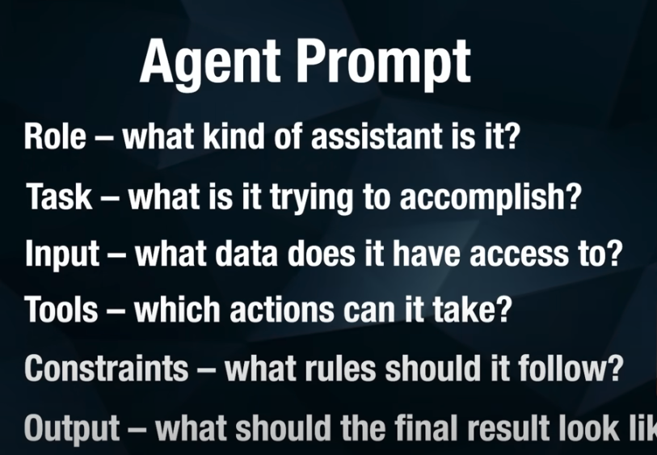
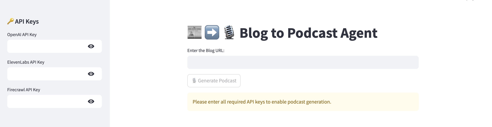
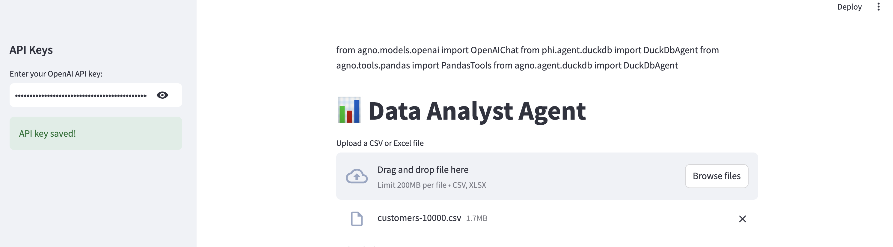
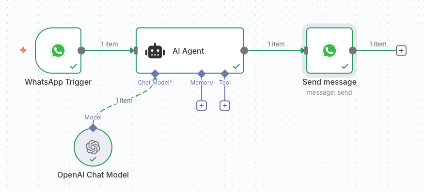
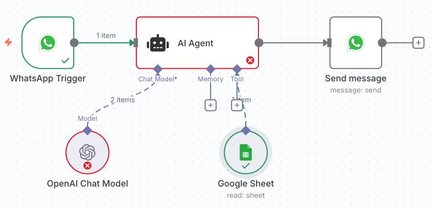

# AI-Multi-Agents-Experiments 
_On a mission to find bugs in our current thinking about AI agents._

[](#license)
[](#contributing)

---

## Table of Contents
- [Overview](#overview)
- [Neuro-San Studio](#neuro-san-studio)
- [Simple Agents](#simple-agents)
- [Notes & Questions](#notes--questions)
- [Resources](#resources)
- [Contributing](#contributing)
- [License](#license)

---

## Overview
Explorations in building and testing multi-agent systems.  
Agents are framed as **Brain (LLM)**, **Memory**, and **Tools**.  

---

## Neuro-San Studio

I tried [Neuro-San Studio](https://github.com/cognizant-ai-lab/neuro-san-studio?tab=readme-ov-file).  

<!--
I could run the examples, but I’m still working on implementing my own example for cap table updates.  
-->

---

## AI Agents

### First AI Agent - From Futurepedia
<!--
[](https://www.youtube.com/watch?v=EH5jx5qPabU)
-->


[](https://www.youtube.com/watch?v=EH5jx5qPabU)

#### Summary
Gets a list of hikes in Zip Code X, gets the weather, gets my calendar, gets air quality -------> Suggets wwhat hike/run to do

#### Key points:  
- **Agents = Brain (LLM), Memory, Tools**  
- **API Requests**  
  - **GET** → pulling information  
  - **POST** → sending information  
- **API** = set of available actions or options  
- **HTTP Request** = a specific instruction to perform one of those actions/options  


#### Agent Prompts
Structure for designing an agent prompt:
- **Role** – what kind of assistant is it?  
- **Task** – what is it trying to accomplish?  
- **Input** – what data does it have access to?  
- **Tools** – which actions can it take?  
- **Constraints** – what rules should it follow?  
- **Output** – what should the final result look like? 

[Open agent-hike-prompt.txt](assets/agent-hike-prompt.txt)


<!--

-->

#### What can go wrong?

---

### AI Blog to Podcast Agent

#### Reference

[](https://github.com/Shubhamsaboo/awesome-llm-apps/tree/main/starter_ai_agents/ai_blog_to_podcast_agent)


[AI Blog to Podcast Agent](https://github.com/Shubhamsaboo/awesome-llm-apps/tree/main/starter_ai_agents/ai_blog_to_podcast_agent)


#### Summary
This is a Streamlit-based application that allows users to convert any blog post into a podcast. The app uses OpenAI's GPT-4 model for summarization, Firecrawl for scraping blog content, and ElevenLabs API for generating audio. Users simply input a blog URL, and the app will generate a podcast episode based on the blog.

#### Fix the code

[open fix_summary_blog_to_podcast_agent.md](blog2podcast/fix_summary_blog_to_podcast_agent.md)

#### Agent Details
Brain: LLM

Tools: ElevenLabs (text to voice) and Firecrawl (blog crawling)

 ```bash
blog_to_podcast_agent = Agent(
                    name="Blog to Podcast Agent",
                    agent_id="blog_to_podcast_agent",
                    model=OpenAIChat(id="gpt-4o"),
                    tools=[
                        ElevenLabsTools(
                            voice_id="JBFqnCBsd6RMkjVDRZzb",
                            model_id="eleven_multilingual_v2",
                            target_directory="audio_generations",
                        ),
                        FirecrawlTools(),
                    ],
                    description="You are an AI agent that can generate audio using the ElevenLabs API.",
                    instructions=[
                        "When the user provides a blog URL:",
                        "1. Use FirecrawlTools to scrape the blog content",
                        "2. Create a concise summary of the blog content that is NO MORE than 2000 characters long",
                        "3. The summary should capture the main points while being engaging and conversational",
                        "4. Use the ElevenLabsTools to convert the summary to audio",
                        "Ensure the summary is within the 2000 character limit to avoid ElevenLabs API limits",
                    ],
                    markdown=True,
                    debug_mode=True,
                )
```

#### What can go wrong?

- Hard to debug
  - too black box ... 
- Other architectures:
  - a deicison tree at the top
    - pass the blog to fircrawl
    - get the text based on url content - using LLM
    - pass the podcast text to ElevenLabs
- Comment: no need for the LLM to be the brain ... the steps are deterministic 


---

### AI Data Analysis Agent

#### Reference

[](https://github.com/Shubhamsaboo/awesome-llm-apps/tree/main/starter_ai_agents/ai_data_analysis_agent)

[AI Data Analysis Agent](https://github.com/Shubhamsaboo/awesome-llm-apps/tree/main/starter_ai_agents/ai_data_analysis_agent)


#### Summary
An AI data analysis Agent built using the Agno Agent framework and Openai's gpt-4o model. This agent helps users analyze their data - csv, excel files through natural language queries, powered by OpenAI's language models and DuckDB for efficient data processing - making data analysis accessible to users regardless of their SQL expertise.

#### Fix the code
Part 1 -
```bash
import json
import tempfile
import csv
import streamlit as st
import pandas as pd
from phi.model.openai import OpenAIChat
from phi.agent.duckdb import DuckDbAgent
from phi.tools.pandas import PandasTools
import re

from dotenv import load_dotenv
import os

```

Part 2 - 
```bash
duckdb_agent = DuckDbAgent(
            model=OpenAIChat(model="gpt-4o", api_key=st.session_state.openai_key),
            semantic_model=json.dumps(semantic_model),
            tools=[PandasTools()],
            markdown=True,
            add_history_to_messages=False,
            followups=False,
            read_tool_call_history=False,
            system_prompt=(
                "You are an expert data analyst. Generate SQL queries to solve the user's query. "
                "Return only the SQL query, enclosed in ```sql ``` and give the final answer."
            ),
        )
 ```


#### What can go wrong?
- Hallucination in understanding the text
- Hallucination in converting the text into SQL code

---
### AI System Architect Advisor with R1

#### Reference
[AI System Architect Advisor with R1](https://github.com/Shubhamsaboo/awesome-llm-apps/tree/main/advanced_ai_agents/single_agent_apps/ai_system_architect_r1)


---
### Cursor Agents

[](https://www.youtube.com/watch?v=8QN23ZThdRY "Click to watch on YouTube")


<!--
[](https://www.youtube.com/watch?v=8QN23ZThdRY)

[](https://www.youtube.com/watch?v=8QN23ZThdRY)
-->

---

### Whatsapp AI Agent - Attempt 1

[](https://www.youtube.com/watch?v=A0OwvNOLNlw)


---
### Whatsapp AI Agent - Attempt 2
[](https://www.youtube.com/shorts/d5I08v-GviE "Click to watch on YouTube")


#### Summary
Made it work for simple tasks of sending a message and respond with a general message


#### Prompt
```bash
Role: You are a WhatsApp assistant that answers user queries using a Google Sheet dataset.  
Task: Interpret each WhatsApp message. If it requires data, query the Google Sheet and return results.  
Input: Natural language questions from WhatsApp users  
Tools: Google Sheet for data lookup.  
Constraints: Be concise, user-friendly. Don’t show query syntax. If no data is found, politely say so. Never make up answers.  
Output: A plain WhatsApp message with the result (or fallback if unavailable).
```

#### What can go wrong?
- Too much trouble debugging
- Too much trouble with system prompt
- Too much trouble with setting up accounts -- following up with instruction 


---
---

## MCP Examples

### Read Emails

#### Summary

I have about 100 emails in my mailbox. I want to chnage them to read and give me a summary of the important messages. 


---
---

## Notes & Questions
- Brain should be **more than an LLM**.  
- If I have a ML algorithm — should it be the brain or a tool?  

---

## Potential Applications
- **YouTube**: Find the best videos on AI agents and summarize takeaways.  
- **Podcasts**: Collect top episodes, with notes on what worked and what didn’t.  

---

## Resources

---

## Contributing
PRs welcome! Open an issue or submit a pull request if you’d like to collaborate.  

---

## License
MIT © PaxAI
